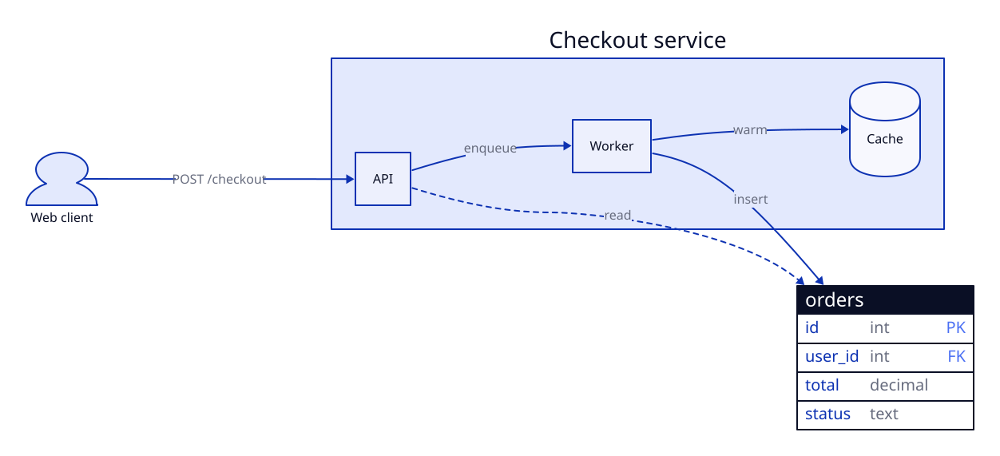
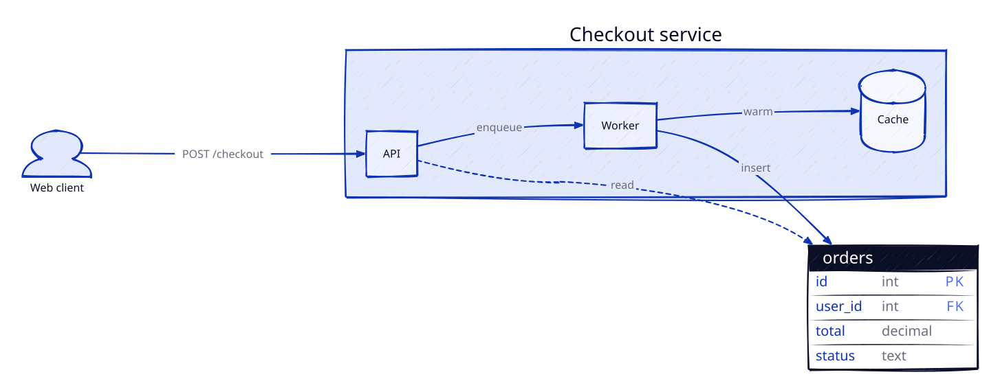
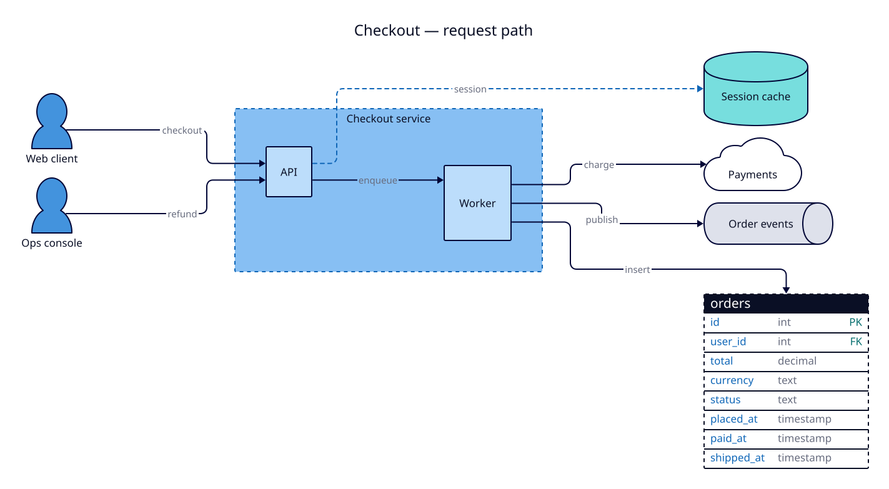
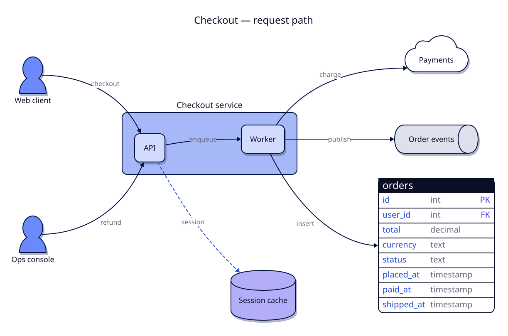
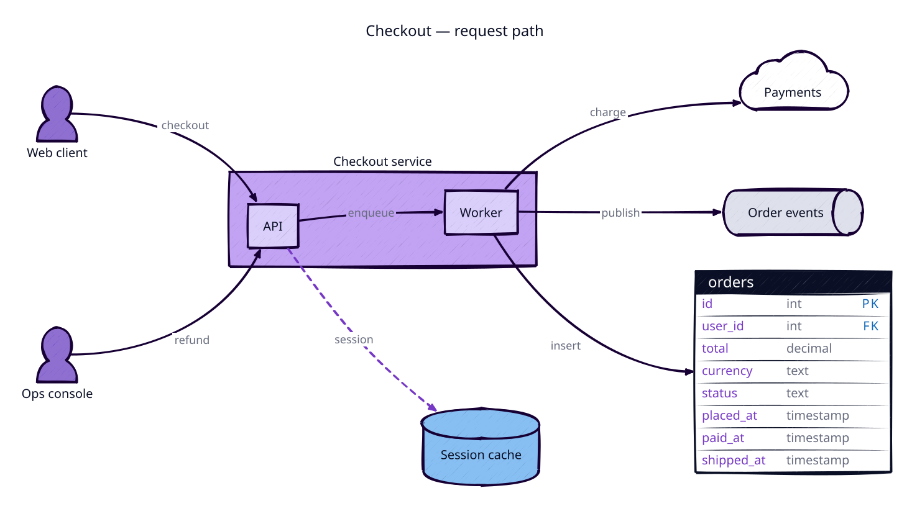
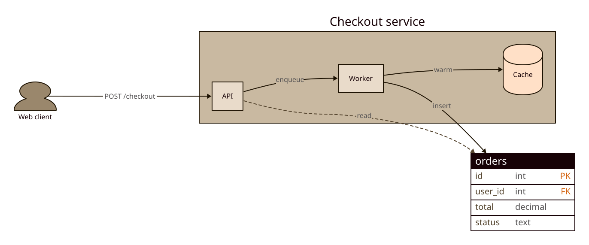
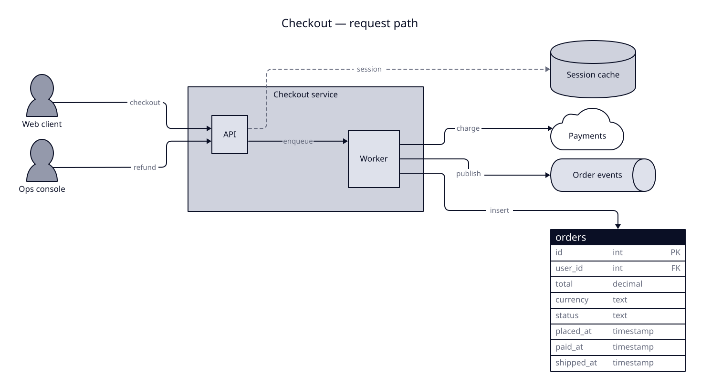
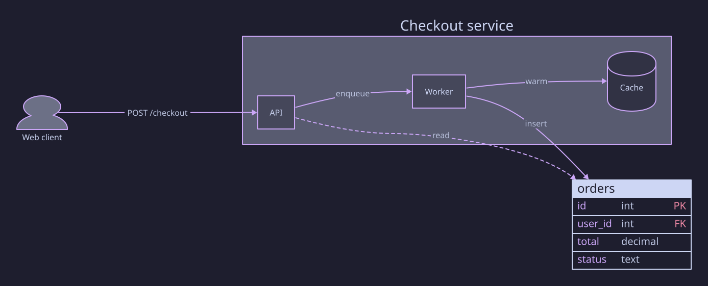
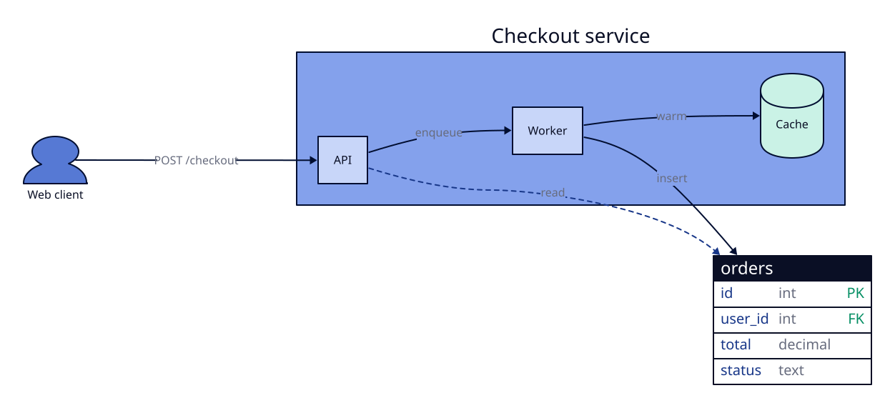

# d2 — diagrams for Claude Code

A Claude Code plugin that turns "draw the login flow" into a [D2](https://d2lang.com) source file
and a rendered PNG, SVG or animated GIF, in a visual style you pick once and share through the
repo.

| | | |
|:-:|:-:|:-:|
|  **1 clean** |  **2 sketch** |  **3 blueprint** |
|  **4 flagship** |  **5 vivid-sketch** |  **6 earth** |
|  **7 mono** |  **8 dark** |  **9 colorblind** |

## What you get

- `/d2:diagram` — writes `docs/diagrams/<name>.d2` and renders it. Auto-triggers whenever you ask
  for an architecture, flow, sequence, ER, state or system diagram; say "as svg", "animated" or
  "animated svg" to change the output, or nothing for the default (PNG).
- `/d2:style` — the one-time style picker (nine presets on a contact sheet), plus `set`, `show`,
  `tweak`, `adopt`, `auto on|off`, `doctor` and `reset`.
- A best-practice guide the skill consults for *which* diagram to draw, and a D2 cheat sheet so
  the source compiles the first time.

## Install

Prerequisites: [d2](https://d2lang.com/tour/install) 0.7 or newer (`brew install d2`, or
`curl -fsSL https://d2lang.com/install.sh | sh -s --`). PNG and GIF output use a headless Chromium
that d2 downloads once (about 150 MB); the skill asks before that happens.

```bash
claude plugin marketplace add ddikman/d2-diagram-plugin
claude plugin install d2@d2-diagram-plugin
```

To try it from a checkout instead: `claude --plugin-dir /path/to/d2-diagram-plugin`.

## First run

The first time a diagram is requested in a repo with no style, the skill renders the same sample
diagram in nine styles, opens a contact sheet in your browser and asks for a number. Your choice
is saved as `docs/diagrams/_style.d2` (commit it), or as your personal default in
`~/.config/d2-diagram/_style.d2` if you answer `personal`. A repo without its own style picks up
the personal one automatically.

## Everyday use

```
> draw the checkout flow: cart, payment service, email worker
> sequence diagram of the OAuth callback, as svg
> make an animated walkthrough of the deploy pipeline
> re-render docs/diagrams/checkout-flow.d2 as png
> /d2:style set mono
> /d2:style auto off        # stop auto-triggering in this checkout; /d2:diagram still works
```

Each diagram is a `.d2` file next to its image, so reviewers diff the source and anyone can
regenerate the image with plain `d2 docs/diagrams/checkout-flow.d2 out.png`.

## How the style works

`_style.d2` is ten lines of ordinary D2:

```d2
# d2-diagram preset: blueprint — Cool blues with orthogonal routing (ELK) and the Inter font.
vars: {
  d2-config: {
    theme-id: 4
    sketch: false
    layout-engine: elk
    pad: 32
    data: {font: inter; default-format: png; animated-format: gif; animate-interval: 1200}
  }
}
```

Every diagram starts with `...@_style`, which spreads that block into the file, so theme, layout,
sketch mode and padding travel with the source and plain `d2` reproduces them. Change the file
and re-render to restyle everything. A single diagram can override anything with a second `vars`
block after the import.

Fonts are the exception: d2 accepts them only as command-line flags, so `scripts/render.sh`
(which the skill always uses) passes the bundled font named in `data.font`. Rendering with plain
`d2` falls back to Source Sans Pro unless you export `D2_FONT_REGULAR` and friends;
`/d2:style show` prints the exact lines.

### Presets

| # | name | theme | layout | font | for |
|---|---|---|---|---|---|
| 1 | clean ★ | Neutral Default | dagre | Source Sans | READMEs, ADRs, "if unsure" |
| 2 | sketch ★ | Neutral Default, sketch | dagre | hand-drawn | RFCs and proposals still in flux |
| 3 | blueprint ★ | Cool Classics | elk | Inter | architecture and infra docs in a repo |
| 4 | flagship | Flagship Terrastruct | dagre | Source Sans | D2's signature look |
| 5 | vivid-sketch | Grape Soda, sketch | dagre | hand-drawn | slides and talks |
| 6 | earth | Earth Tones | dagre | Lora | warm, print-friendly |
| 7 | mono | Neutral Grey | elk | IBM Plex Mono | engineering docs |
| 8 | dark | Dark Mauve | dagre | Inter | dark-mode docs and decks |
| 9 | colorblind | Colorblind Clear | dagre | Source Sans | accessible palette |

More by name with `/d2:style set <name>`: `terminal`, `origami`, `c4`, `adaptive` (follows the
viewer's dark mode, SVG only), `berry`. Any theme id or colour override can be set with
`/d2:style tweak`; see `skills/style/references/style-config.md`.

Bundled fonts (SIL Open Font License, unmodified): [Inter](https://github.com/rsms/inter),
[IBM Plex Mono](https://github.com/IBM/plex), [Lora](https://github.com/cyrealtype/Lora-Cyrillic).

## Output formats

| Ask for | You get | Notes |
|---|---|---|
| nothing / "png" / "rendered" | `name.png` | default; needs d2's Chromium once |
| "svg" | `name.svg` | crisp, keeps tooltips and links, no browser needed |
| "animated" / "gif" | `name.gif` | the diagram is written as `steps:` and cycled |
| "animated svg" | `name-animated.svg` | same, as SVG |

## Using it alongside other diagram skills

If another skill also answers diagram requests (gstack's `/diagram`, for example), add one line to
your `CLAUDE.md` so routing is unambiguous:

```
For diagrams use /d2:diagram (D2), not /diagram.
```

To stop the skill from starting on its own in one checkout, run `/d2:style auto off`; it writes
`skillOverrides` to `.claude/settings.local.json` and the skill's own preflight honours it.

## Layout of this repo

```
.claude-plugin/   plugin.json, marketplace.json
skills/diagram/   SKILL.md + references (diagram types, D2 cheat sheet, output formats)
skills/style/     SKILL.md + references (style file, themes, colour keys, fonts)
scripts/          preflight.sh, render.sh, preview.sh, fetch-fonts.sh
assets/           sample.d2, presets/*.d2, fonts/, contact-sheet.html
tests/smoke.sh    end-to-end checks (add --png to exercise Chromium)
```

## Development

```bash
bash tests/smoke.sh            # presets, fonts, imports, preflight, animation rules
bash tests/smoke.sh --png      # plus a PNG render (downloads Chromium on first use)
claude plugin validate ./ --strict
scripts/fetch-fonts.sh         # refresh the bundled fonts from their pinned sources
```

## License

MIT for the plugin. Fonts under `assets/fonts/` keep their own SIL Open Font License 1.1.
