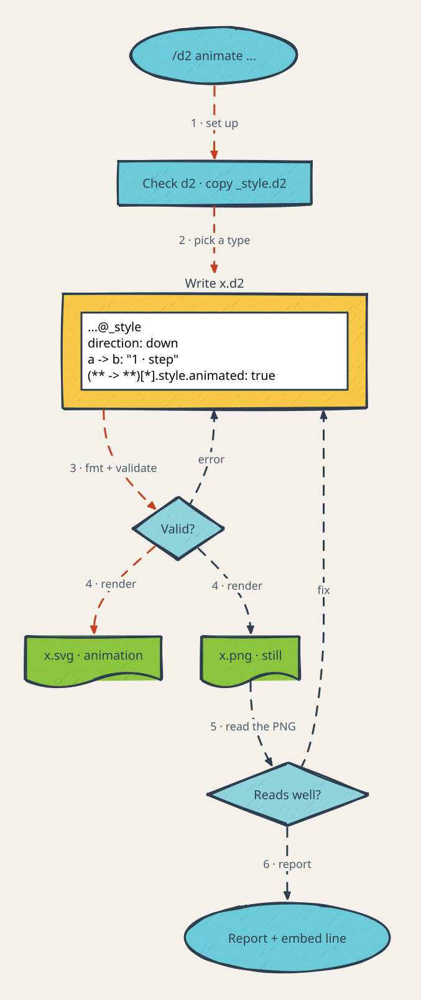
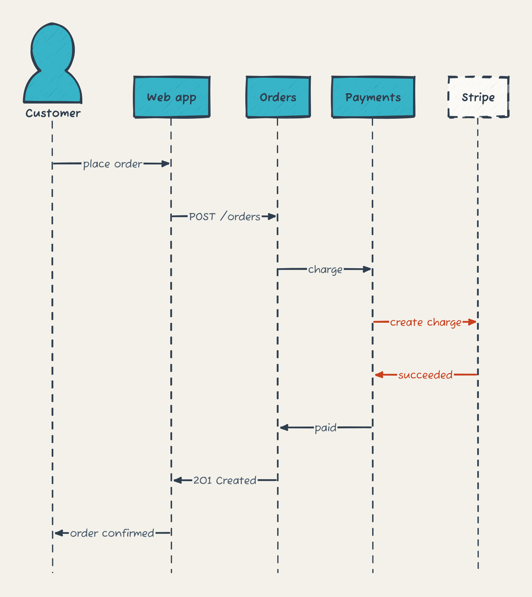
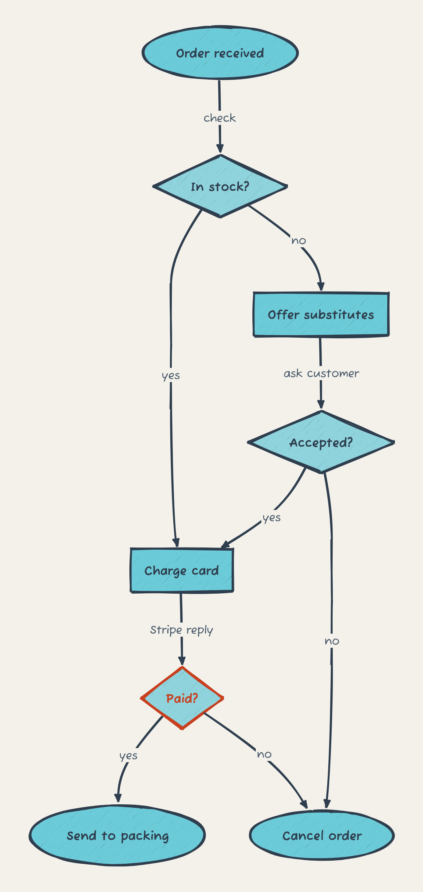
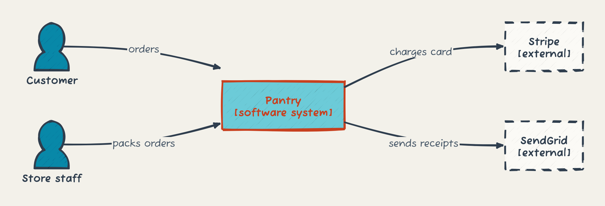
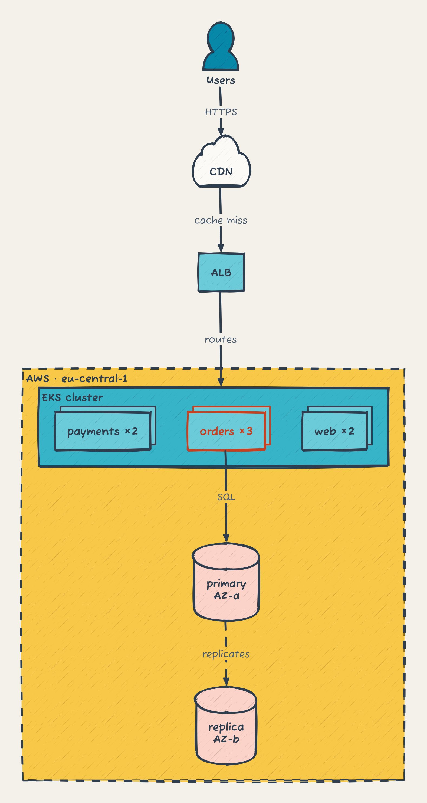
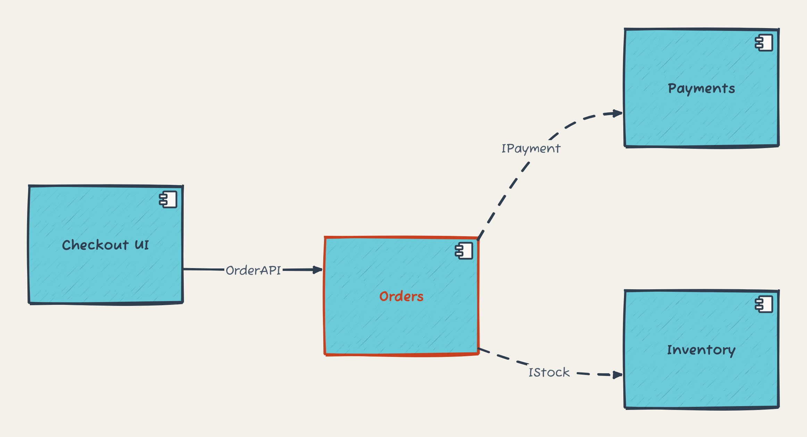
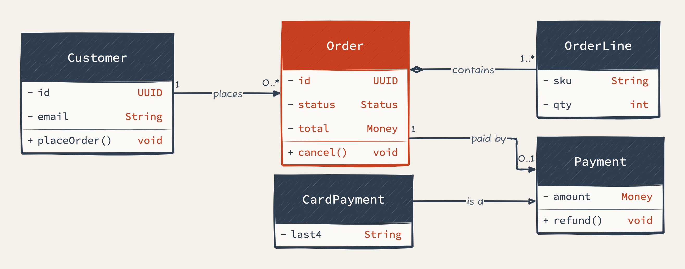
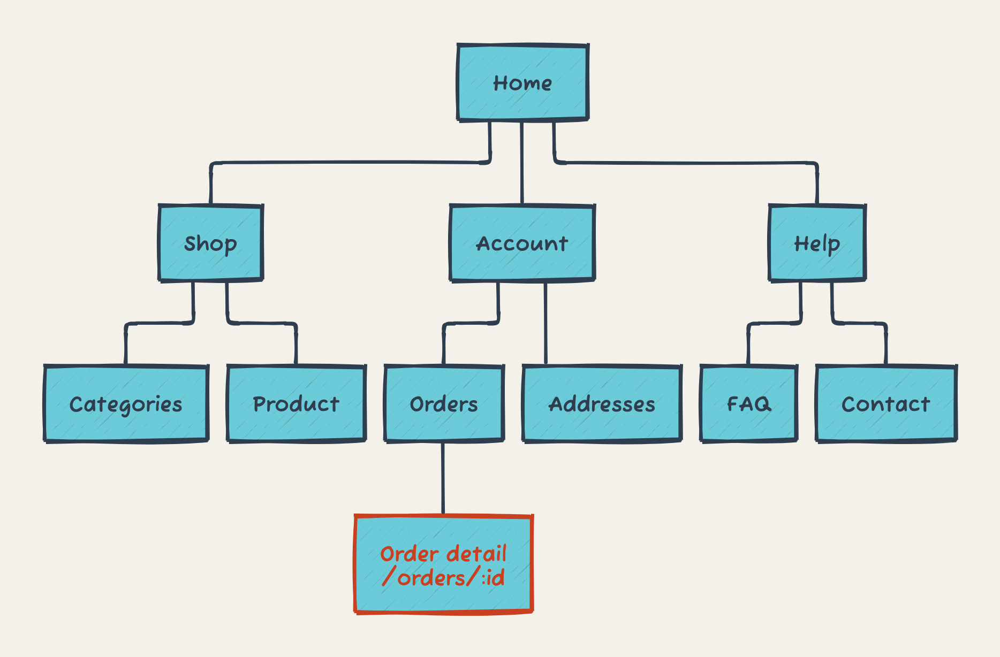
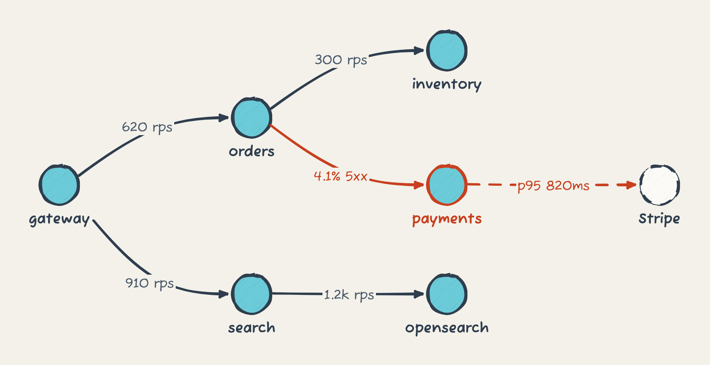

# My D2 diagram style

A personal Claude Code skill. Ask for a diagram and `/d2` writes a [D2](https://d2lang.com) source
file next to a rendered PNG (or SVG; ask for animated and the lines flow) in my style: hand-drawn
sketch mode, slate ink, teal and cyan shapes, yellow groups, soft orange databases, on warm grey
paper.

## Example

```text
/d2 animate the process diagram of how this skill generates an animated svg
```

That prompt produced [`diagrams/animated-svg-process.d2`](diagrams/animated-svg-process.d2) and the
SVG below, whose lines flow.

<p align="center">
  
</p>

## Diagram types

One diagram, one argument: `/d2` picks the type from the question the picture has to answer. My
everyday three come first, then six more worth knowing. All nine draw the same small online shop,
and when you ask for one of these types the skill starts from its file.

<table>
  <tr>
    <td width="33%" valign="top"><a href="diagrams/sequence.png"></a><br><a href="diagrams/sequence.d2"><b>Sequence</b></a>: who does what, in which order?</td>
    <td width="33%" valign="top"><a href="diagrams/flow.png"></a><br><a href="diagrams/flow.d2"><b>Flow</b></a>: what happens, and where does it branch?</td>
    <td width="33%" valign="top"><a href="diagrams/process.png"></a><br><a href="diagrams/process.d2"><b>Process</b></a>: what are the steps, start to finish?</td>
  </tr>
  <tr>
    <td valign="top"><a href="diagrams/c4-context.png"></a><br><a href="diagrams/c4-context.d2"><b>C4 system context</b></a>: what is in scope, and who and what does it talk to?</td>
    <td valign="top"><a href="diagrams/deployment.png"></a><br><a href="diagrams/deployment.d2"><b>Deployment</b></a>: where does it run?</td>
    <td valign="top"><a href="diagrams/component.png"></a><br><a href="diagrams/component.d2"><b>Component</b></a>: what are the parts, and who depends on whom?</td>
  </tr>
  <tr>
    <td valign="top"><a href="diagrams/class.png"></a><br><a href="diagrams/class.d2"><b>Class</b></a>: which entities, with which fields and cardinalities?</td>
    <td valign="top"><a href="diagrams/sitemap.png"></a><br><a href="diagrams/sitemap.d2"><b>Sitemap</b></a>: which pages and routes exist?</td>
    <td valign="top"><a href="diagrams/service-dependency-map.png"></a><br><a href="diagrams/service-dependency-map.d2"><b>Service dependency map</b></a>: where does live traffic go, and where do errors sit?</td>
  </tr>
</table>

## Install

The skill follows Anthropic's open [Agent Skills](https://agentskills.io) format, so it installs
with the `skills` CLI, the standard installer for that format, into Claude Code, Cursor, Codex,
OpenCode and some seventy other agents.

```bash
# Claude Code, user-level (available in every project)
npx skills add ddikman/d2-diagram-plugin -a claude-code -g

# Cursor
npx skills add ddikman/d2-diagram-plugin -a cursor -g

# every agent the CLI knows about, or any other by name (codex, opencode, ...)
npx skills add ddikman/d2-diagram-plugin -a '*' -g
```

Drop `-g` to install into the current project only (it lands in `.agents/skills/d2` with a
symlink for each agent). `npx skills list` shows what is installed, `npx skills update` pulls
the latest version, `npx skills remove d2` takes it out again.

The format has no install hooks, so nothing runs at install time. Instead the skill checks for
[d2](https://d2lang.com) the first time it is used and, if it is missing, asks before installing
it: Homebrew on macOS, otherwise the official install script into `~/.local` (no sudo). Nothing
is installed without a yes. To do it up front: `brew install d2` or
`curl -fsSL https://d2lang.com/install.sh | sh -s --`.

Without the CLI, a clone and a symlink do the same for Claude Code:

```bash
git clone git@github.com:ddikman/d2-diagram-plugin.git ~/code/d2-diagram-plugin
ln -s ~/code/d2-diagram-plugin ~/.claude/skills/d2
```

## How it works

Diagrams land in `docs/diagrams/<name>.d2` beside their image (`diagrams/` in a repo without
`docs/`, like this one). Each one starts with `...@_style`, importing a copy of `style.d2` that
sits next to it, so plain `d2 docs/diagrams/x.d2 x.png` gives the same picture with no flags. The
style is ordinary D2: a `vars` block with the colours, a paper colour and a few `***` house rules.
Edit `style.d2` to change the master, then copy it over a repo's `_style.d2` and re-render. The
colour keys are explained at the top of the file.

`references/` holds the two notes the skill reads while drawing: which diagram fits which question,
and the D2 syntax that is easy to get wrong. `diagrams/` holds the worked example for each type
above, which the skill reads before drawing that type.
